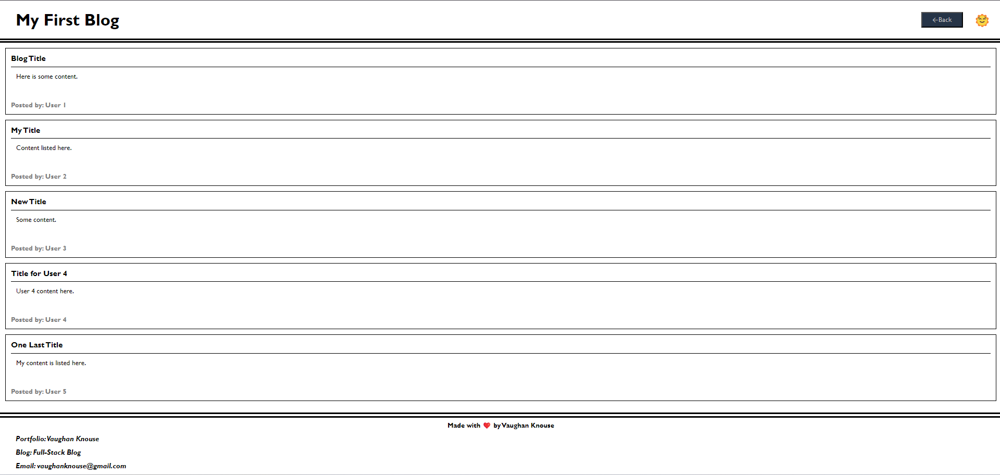
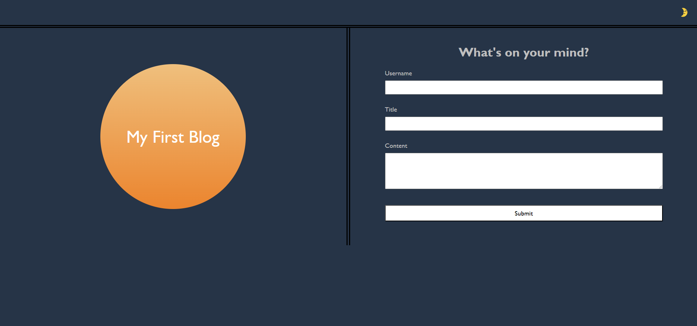
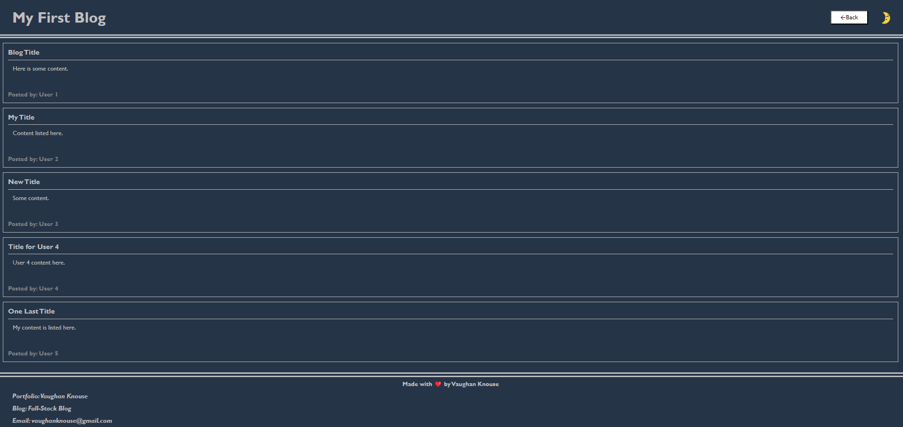

# Web APIs: Personal Blog

## Description

This week's challenge involves creating a two-page personal blog website from scratch using JavaScript, HTML, and CSS. Through building a content form, dynamically rendering blog posts, and implementing a light/dark mode toggle, this blog site enables users to submit and view various blog posts so they may showcase their individual thoughts and experiences.


## User Story

```md
AS A marketing student,
I WANT a personal blog
SO THAT I can showcase my thoughts and experiences.
```

## Acceptance Criteria

```md
GIVEN a personal blog
WHEN I load the app,
THEN I am presented with the landing page containing a form with labels and inputs for username, blog title, and blog content.
WHEN I submit the form,
THEN blog post data is stored to localStorage.
WHEN the form submits,
THEN I am redirected to the posts page.
WHEN I enter try to submit a form without a username, title, or content,
THEN I am presented with a message that prompts me to complete the form.
WHEN I view the posts page,
THEN I am presented with a header, with a light mode/dark mode toggle, and a "Back" button.
WHEN I click the light mode/dark mode toggle,
THEN the page content's styles update to reflect the selection.
WHEN I click the "Back" button,
THEN I am redirected back to the landing page where I can input more blog entries.
WHEN I view the main content,
THEN I am presented with a list of blog posts that are pulled from localStorage.
WHEN I view localStorage,
THEN I am presented with a JSON array of blog post objects, each including the post author's username, title of the post, and post's content.
WHEN I take a closer look at a single blog entry in the list,
THEN I can see the title, the content, and the author of the post.
WHEN I view the footer,
THEN I am presented with a link to the developer's portfolio.
```

## Mock Up
The following image shows the web application's appearance:








## Link to Deployed Application

https://vaughanknouse.github.io/web-apis-personal-blog/


## Credits
Used the following sources as tutorials and guidelines:
https://github.com/ikatyang/emoji-cheat-sheet/blob/master/README.md

https://developer.mozilla.org/en-US/docs/Web/API/Window/localStorage

Also utilized the Xpert Learning assistant for some portions of my code:
https://bootcampspot.instructure.com/courses/5293/external_tools/313